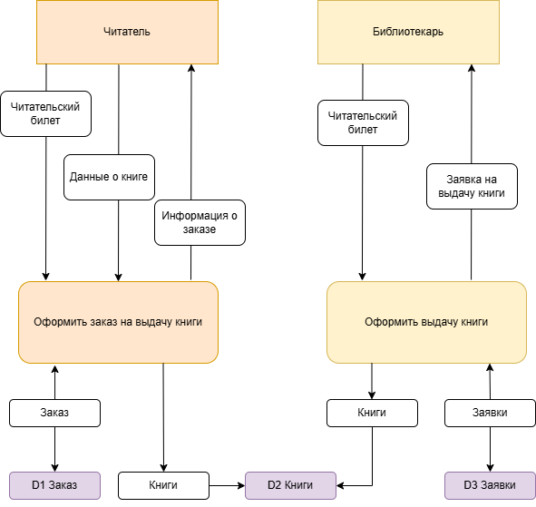
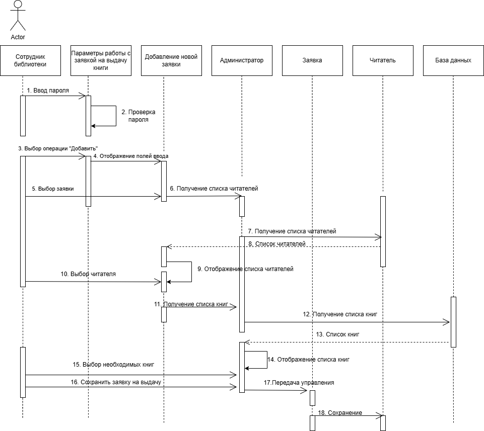
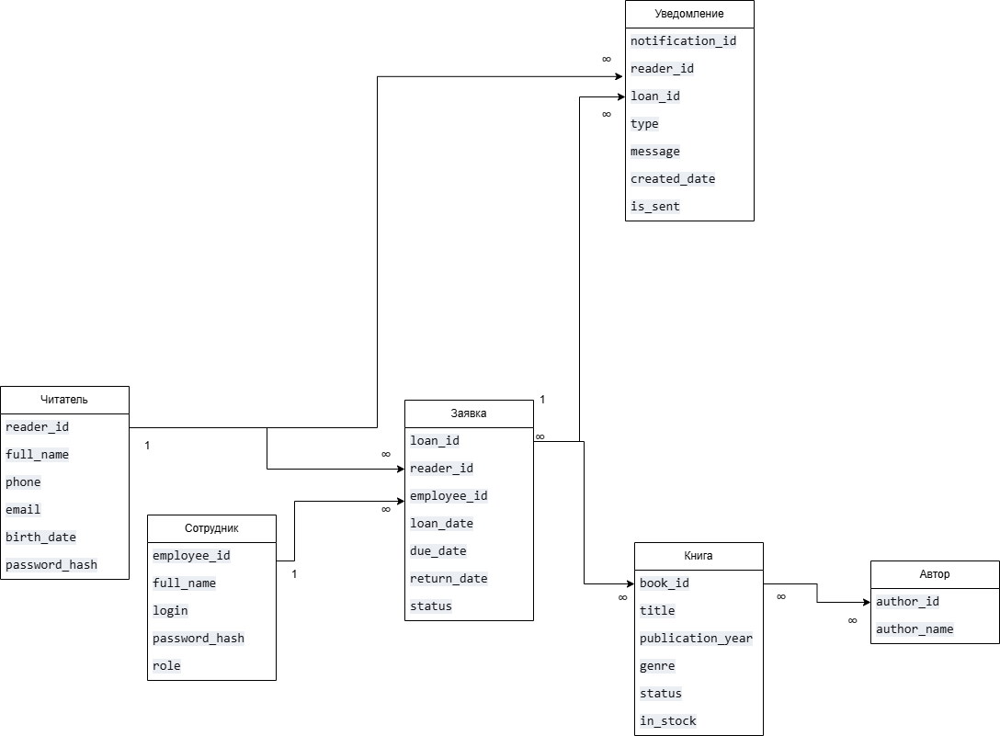

**Описание проекта: Информационная система библиотеки**

Данный проект представляет собой создание современной компьютерной системы для полной автоматизации работы библиотеки. Основная цель — заменить бумажный учёт и ручные операции на цифровые решения. Система будет включать в себя базу данных всего книжного фонда, электронные картотеки читателей и инструменты для учёта выдачи и возврата книг.

Для сотрудников библиотеки система станет удобным рабочим инструментом, который позволит быстро обслуживать посетителей, контролировать движение книг и вести учёт без бумажных журналов. Для читателей будет создан онлайн-каталог. Через него можно будет удалённо искать нужные книги, проверять их наличие в фонде и бронировать.

Внедрение этой системы решит основные проблемы: сократит время на рутинные операции, уменьшит количество ошибок в учёте и сделает библиотеку более удобной и доступной для всех пользователей. Проект предусматривает создание простого и понятного интерфейса, а также надёжной основы для возможного добавления нового функционала в будущем.

**Ментальная карта**

Данная ментальная карта представляет собой структурированное описание функционала информационной системы библиотеки, включающее четыре ключевых модуля: управление фондом (учёт, индексация, списание и пополнение изданий), администрирование (настройки, резервное копирование и отчётность), обслуживание читателей (регистрация, выдача, возврат книг и история операций) и личный кабинет пользователя (онлайн-поиск, бронирование, уведомления), что в совокупности образует целостную экосистему для автоматизации основных библиотечных процессов и удобного взаимодействия с читателями.

**IDEF0**

Представленная модель в нотации IDEF0 наглядно отображает информационную систему библиотеки как центральный преобразующий блок ("Обеспечить работу библиотеки"), который принимает на вход запросы читателей и новые поступления, а на выходе выдаёт обслуженных читателей, отчёты и список списанных изданий. Для функционирования этой системы необходимы такие механизмы, как персонал и оборудование, а управляют всем процессом и задают его границы внешние регулирующие факторы: законодательство, внутренние правила библиотеки и выделенный бюджет. Таким образом, диаграмма демонстрирует, как система, используя ресурсы и следуя регламентам, преобразует входящие потоки в конкретные результаты, обеспечивая основной рабочий цикл библиотеки.

**DFD**

Диаграмма DFD отображает ключевые данные и процессы взаимодействия читателя с библиотечной системой: читатель предоставляет свой билет и информацию о книге, чтобы оформить заказ на выдачу книги, этот процесс сохраняет сформированный заказ в хранилище D1 и использует данные из каталога книг D2. Далее библиотекарь, используя читательский билет и заявку, оформляет выдачу книги, этот процесс обращается к хранилищу заказов D1, каталогу книг D2 и фиксирует факт выдачи в хранилище заявок D3, демонстрируя поток данных между внешними сущностями, процессами и хранилищами информации.

**BPMN**

Данная диаграмма описывает упрощенный рабочий процесс от заказа читателя до выдачи книг. Читатель оформляет запрос через сайт, администратор проверяет наличие в системе и передает задание библиотекарю, который комплектует заказ. Если книги нет в наличии, читателя уведомляют; если есть — заказ собирают, хранят и выдают. Процесс демонстрирует разделение ролей и этапов обработки запроса в информационной системе.

**Модели в нотации UML**

На диаграмме изображена сущностно-связная модель библиотечной системы, где центральными элементами являются Читатель с его персональными данными и операциями, Заявка на выдачу книги, содержащая идентификаторы выдачи и книги, даты выдачи, срок и возврата и Каталог книг с описательными атрибутами, включая автора и жанр. Связи между этими сущностями отражают процесс работы: читатель создаёт заявку, которая обрабатывается Сотрудником библиотеки; при этом заявка ссылается на конкретную книгу из каталога, а также фиксирует сроки выдачи и факт возврата, формируя тем самым полный цикл учёта библиотечных операций.

Диаграмма описывает функциональные возможности двух основных ролей в библиотечной системе. Администратор отвечает за модерацию профилей пользователей, книг и заявок на выдачу, а также за проверку соблюдения требований и работу с собственным аккаунтом. Сотрудник библиотеки выполняет операции по обслуживанию читателей: авторизацию, поиск в каталоге, оформление выдачи и возврата книг, уведомление о задолженности, а также управление фондом (добавление и списание книг).

Диаграмма детально описывает процесс добавления новой заявки на выдачу книги. Сотрудник библиотеки инициирует операцию, проходя авторизацию (ввод и проверка пароля), после чего выбирает функцию добавления. Далее система последовательно запрашивает у Базы данных и отображает списки читателей и книг, из которых сотрудник выбирает нужные. Администратор выступает как актор, который может принимать управление, а Читатель и сама Заявка являются объектами, с которыми взаимодействуют. Финальным шагом является сохранение сформированной заявки в базу данных и передача управления.

Данная диаграмма отображает физическую архитектуру информационной системы библиотеки (ИСБ). Она включает клиентские устройства: устройство пользователя с Web-браузером, Mobile Client и Admin PC, на которых работают соответствующие артефакты (веб-интерфейс, мобильное приложение и LibrarianApp.exe). Серверная часть состоит из Web-Сервера Библиотеки, Сервера приложений ИСБ, где развёрнуты основные сервисы — LibraryService.jar и App.jar и отдельного DB server с СУБД Postgresql. Связи показывают взаимодействие между клиентскими приложениями, промежуточным серверным слоем и сервером базы данных.

**ER диаграмма**

ER-диаграмма детально отображает структуру базы данных библиотечной системы, выделяя ключевые сущности: Читатель (с данными для идентификации и авторизации), Сотрудник (с разделением ролей), Книга (с атрибутами описания и статусами наличия), Автор, Заявка на выдачу (которая связывает читателя, сотрудника и фиксирует все даты жизненного цикла выдачи) и Уведомление (для оповещений о задолженностях). Четко показаны связи между ними: отношения «один ко многим» между Читателем и Заявками, а также между Сотрудником и Заявками, что отражает логику работы — каждый экземпляр выдачи инициируется одним конкретным читателем и оформляется одним конкретным сотрудником, в то время как один пользователь или работник может участвовать в множестве таких операций.
