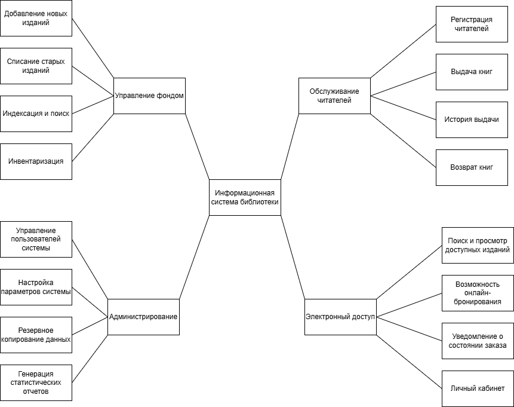

**Описание проекта: Информационная система библиотеки**

Данный проект представляет собой создание современной компьютерной системы для полной автоматизации работы библиотеки. Основная цель — заменить бумажный учёт и ручные операции на цифровые решения. Система будет включать в себя базу данных всего книжного фонда, электронные картотеки читателей и инструменты для учёта выдачи и возврата книг.

Для сотрудников библиотеки система станет удобным рабочим инструментом, который позволит быстро обслуживать посетителей, контролировать движение книг и вести учёт без бумажных журналов. Для читателей будет создан онлайн-каталог. Через него можно будет удалённо искать нужные книги, проверять их наличие в фонде и бронировать.

Внедрение этой системы решит основные проблемы: сократит время на рутинные операции, уменьшит количество ошибок в учёте и сделает библиотеку более удобной и доступной для всех пользователей. Проект предусматривает создание простого и понятного интерфейса, а также надёжной основы для возможного добавления нового функционала в будущем.

Данная ментальная карта представляет собой структурированное описание функционала информационной системы библиотеки, включающее четыре ключевых модуля: управление фондом (учёт, индексация, списание и пополнение изданий), администрирование (настройки, резервное копирование и отчётность), обслуживание читателей (регистрация, выдача, возврат книг и история операций) и личный кабинет пользователя (онлайн-поиск, бронирование, уведомления), что в совокупности образует целостную экосистему для автоматизации основных библиотечных процессов и удобного взаимодействия с читателями.

